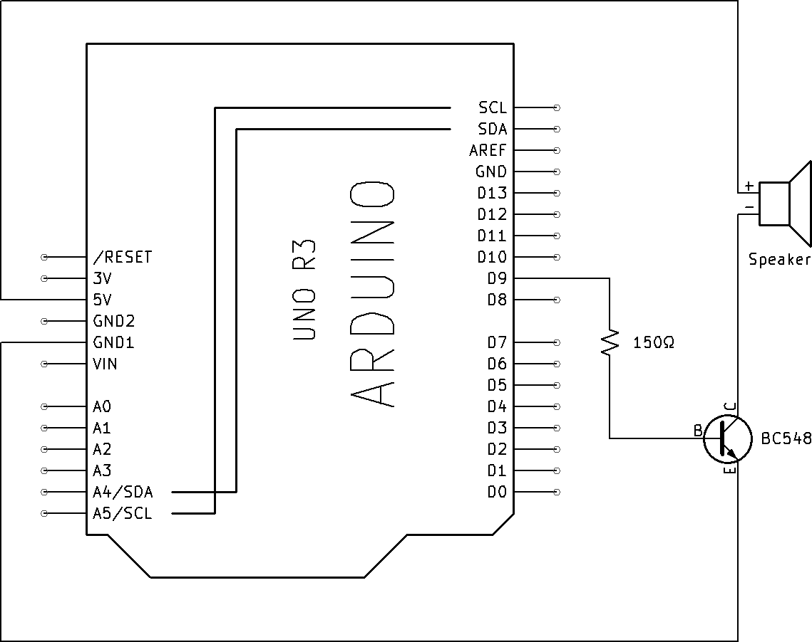

# 🧠 Ollama + DeepSeek + Flask API

This project sets up a simple Flask-based API that connects with the `deepseek-r1:1.5b` model running locally via [Ollama](https://ollama.com/). It lets you interact with the model using standard HTTP requests.

---

## 📦 Prerequisites

Make sure the following are installed on your system:

- Python 3.8 or higher
- Git (optional, to clone this repo)
- Ollama (for running large language models locally)
- Internet connection (for downloading models and packages)

---

## 🛠️ Step-by-Step Setup

### 1. ✅ Install Python Packages

Create a new folder for the project and navigate into it:

```bash
mkdir ollama-deepseek-flask
cd ollama-deepseek-flask
```

Create a virtual environment (optional but recommended):

```bash
python3 -m venv venv # On Windows: python -m venv venv
source venv/bin/activate  # On Windows: venv\Scripts\activate
```

Install required libraries:

```bash
pip install -r requirements.txt
```

### 2. 🧰 Install Ollama

Install Ollana by running:

**macOS/Linux:**
```bash
curl -fsSL https://ollama.com/install.sh | sh #for 
```

**Windows:**
Download the installer from https://ollama.com/download and follow the setup instructions.

### 3. 🚀 Start the Ollama Service
In a separate terminal window or tab:

```bash
ollama serve
```
This starts the local Ollama server.

### 4. 🧠 Download DeepSeek Model
Run the following command to download the DeepSeek-r1:1.5B model:

```bash
ollama pull deepseek-r1:1.5b
```
This may take a few minutes depending on your connection speed.

### 5. 🔌 Integrating Arduino with Flask
Build Your Arduino Board

Build it based on this diagram ⬇


Program Your Arduino Board

- Go to buzzer folder and open buzzer.ino
- Go to Tools and make sure your port is "COM4" and board is "Arduino Uno"
- Once everything is set, upload the code to your arduino by clicking the right arrow button on your top left 
- You should be seeing the "Done Uploading" comment on your bottom right as your arduino board is set to run based on the code you had uploaded.

Connect Your Arduino Board

- Plug your Arduino into your computer using a USB cable.
- Open the Arduino IDE and upload a sketch (e.g., sending sensor data via Serial).

### 6. ▶️ Run the Flask Server
Start the Flask server:

```bash
python QuizServer.py
```

The app will be available at:

```cpp
http://127.0.0.1:5000/
```

### 🧠 Notes
- Ensure ollama serve is running before launching the Flask app.

- The deepseek-r1:1.5b model can require a decent amount of memory (~8GB+). If your computer memory is lower than 8GB, it is not recommended to use this model but instead use smaller model like microsofe-phi2 or microsoft-phi3-mini but the structure of the code in QuizServer.py may be needed to change.

- You can customize the prompt logic in QuizServer.py as needed.

- The test folder is imcomplete as the backend and frontend still not working well. You may try the test folder if you want to but I recommend try the demo folder although it don't have AI intergraded 